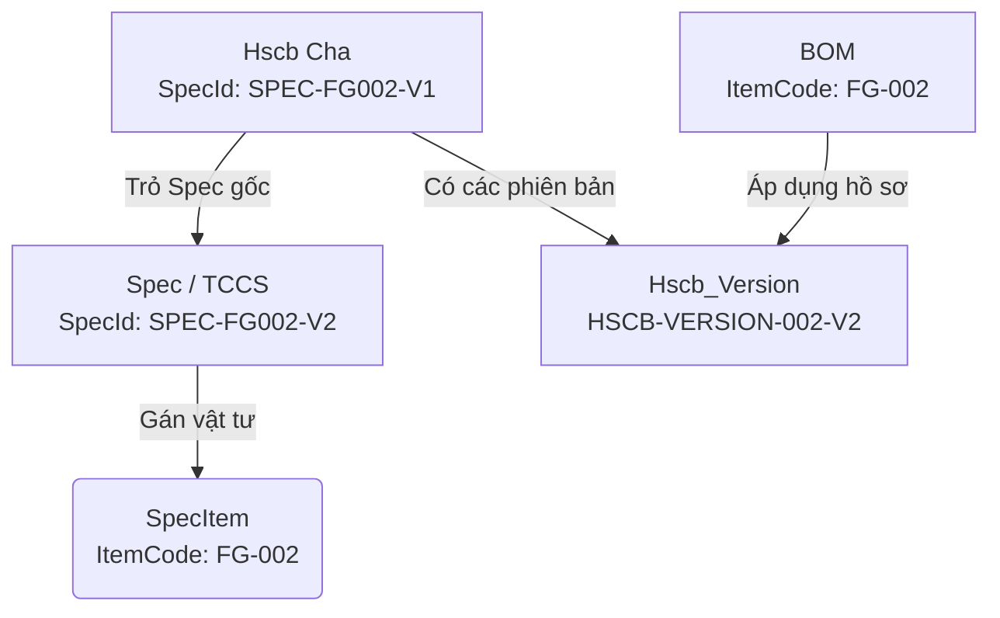

# Nghiệp vụ liên kết Tiêu chuẩn (TCCS/Spec) - Hồ sơ công bố (HSCB) - Định mức kỹ thuật (BOM)

Tài liệu này ghi lại các quy tắc nghiệp vụ (Business Logic) và các kẽ hở dữ liệu cần lưu ý khi xây dựng tính năng kiểm tra chéo công thức sản phẩm (BOM) có tuân thủ Tiêu chuẩn kỹ thuật cơ sở (TCCS) và Hồ sơ tự công bố sản phẩm (HSCB) hay không.

---

## 1. Mối quan hệ giữa các Thực thể (Entities & Relations)

Hệ thống xoay quanh 3 thực thể chính:

1. **Tiêu chuẩn (Spec / TCCS)**:
   - Chứa thông tin kỹ thuật cơ sở.
   - Có thể có nhiều phiên bản (Ví dụ: `SPEC-FG002-V1`, `SPEC-FG002-V2`).
   - Ánh xạ đến danh sách **Vật tư áp dụng** (`SpecItems`) qua trường `ItemCode`.
2. **Hồ sơ tự công bố (HSCB)**:
   - Là hồ sơ pháp lý lưu hành của sản phẩm.
   - Bản ghi cha (`Hscb`) trỏ đến Tiêu chuẩn qua trường `SpecId`.
   - Có nhiều phiên bản con (`HscbVersions`) đại diện cho lịch sử tự công bố của sản phẩm (Ví dụ: `HSCB-VERSION-002` ứng với Spec V1, `HSCB-VERSION-002-V2` ứng với Spec V2).
3. **Định mức kỹ thuật (BOM)**:
   - Công thức sản xuất cho sản phẩm cha (`ItemCode`).
   - Ở cấp độ cha (Header), BOM liên kết với Hồ sơ tự công bố qua trường `Selected_HscbVersionId`.
   - Ở cấp độ nguyên liệu con (`BomLines`), từng nguyên liệu/bao bì đổ vào nồi liên kết trực tiếp với Spec qua `Selected_SpecId`.

---

## 2. Quy tắc truy vấn ngược (TCCS -> BOM đang áp dụng)

Khi xem chi tiết một bản Tiêu chuẩn (Spec), hệ thống cần hiển thị danh sách vật tư áp dụng, và với mỗi vật tư phải liệt kê được **các BOM đang tuân thủ tiêu chuẩn này**.

Để xác định một BOM có đang áp dụng tiêu chuẩn đang xem hay không, ta chia làm 2 trường hợp:

### Trường hợp 1: Vật tư là một Nguyên liệu con trong công thức (BOM con)

- **Logic**: Nếu vật tư đó nằm trong các dòng nguyên vật liệu (`BomLines`) của BOM, và dòng vật liệu đó chọn đúng Spec đang xem.
- **Điều kiện khớp**:
  $$\text{line.Selected\_SpecId} === \text{specItem.SpecId} \quad \text{AND} \quad \text{line.ErpItemCode} === \text{specItem.ItemCode}$$

### Trường hợp 2: Vật tư là chính Sản phẩm cha sở hữu công thức (BOM cha - Header level)

- **Logic**: Nếu vật tư đó là thành phẩm đầu ra của BOM, và BOM đó gán cho phiên bản HSCB thuộc tiêu chuẩn đang xem.
- **Kẽ hở dữ liệu (Logic Gap)**:
  - Bản ghi cha `Hscb` giữ khoá ngoại `SpecId` trỏ trực tiếp đến Spec V1. Khi có Spec V2, schema cơ sở dữ liệu không có trường để `Hscb_Version` trỏ trực tiếp sang Spec V2.
  - Vì thế, nếu so sánh trực tiếp SpecId của HSCB cha, phiên bản Spec V2 sẽ **không bao giờ** tìm thấy BOM cha, dù người dùng đã nâng cấp BOM đó sang bản tự công bố V2 (`HSCB-VERSION-002-V2`).
- **Giải pháp Khắc phục (Version-Suffix Fallback)**:
  1. Lấy mã Spec cơ sở (bỏ hậu tố `-V1`, `-V2`, ...).
  2. Xác định hậu tố phiên bản của BOM dựa trên `Selected_HscbVersionId` (Ví dụ: đuôi `-V2` ứng với phiên bản V2).
  3. Ghép lại thành mã Spec mục tiêu (`targetSpecId`) và đối chiếu với Spec đang xem.

---

## 3. Lưu ý khi Debug và Vận hành dữ liệu mock

- **Hiện tượng Reset Store**: Khi cập nhật code dẫn đến Vite HMR reload lại trang, toàn bộ Redux State tạm thời trên trình duyệt sẽ bị reset về dữ liệu mock ban đầu.
- **Lệch pha dữ liệu mock**: Một số sản phẩm cha như `FG-002` (Mì Omachi) khi có TCCS V2 (`SPEC-FG002-V2`) thì mặc định ban đầu `BOM-002` vẫn được mock chỉ định dùng `HSCB-VERSION-002` (V1). Do đó, BOM này sẽ không hiển thị ở TCCS V2 cho đến khi:
  1. Người dùng thao tác trên giao diện cập nhật BOM sang Hồ sơ V2 (`HSCB-VERSION-002-V2`).
  2. Hoặc cập nhật cứng giá trị mặc định trong file dữ liệu mock [bom.ts](file:///Volumes/ADATA%20SD810/visual/src/local-data/bom.ts).
